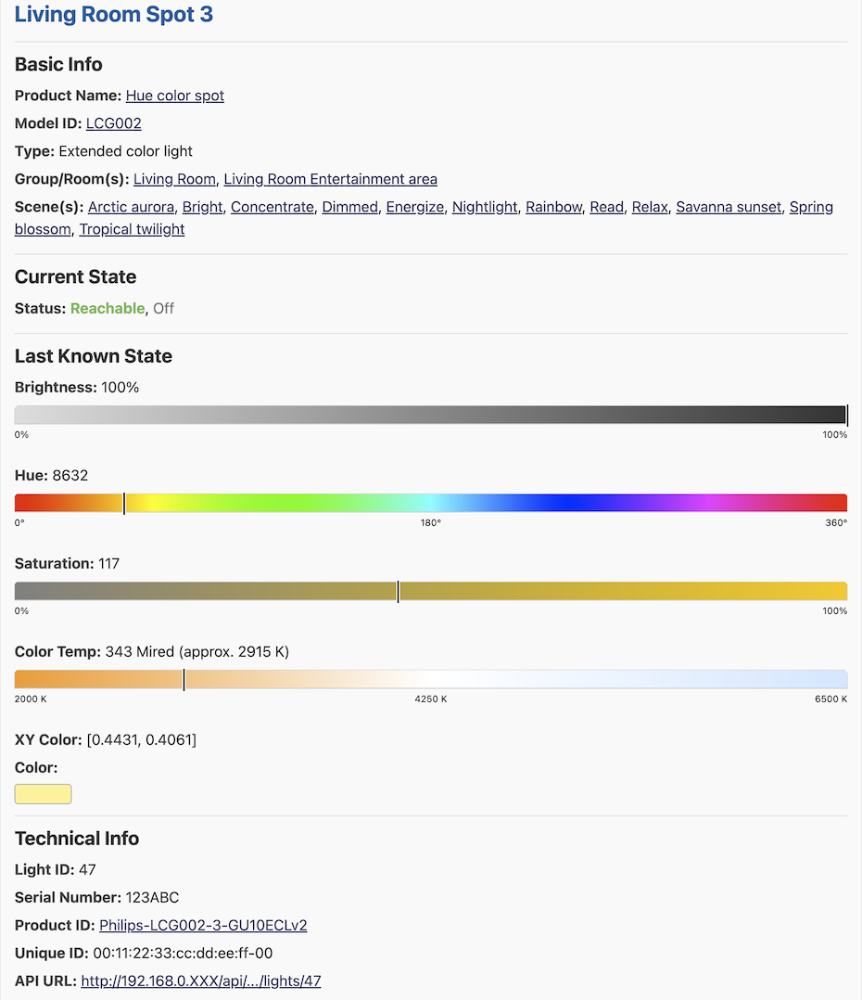
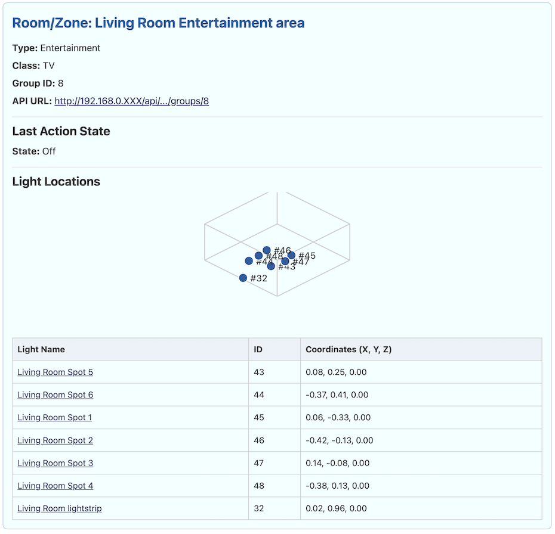
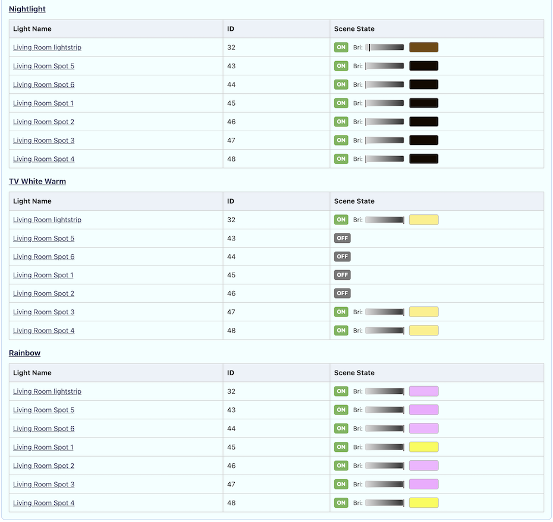
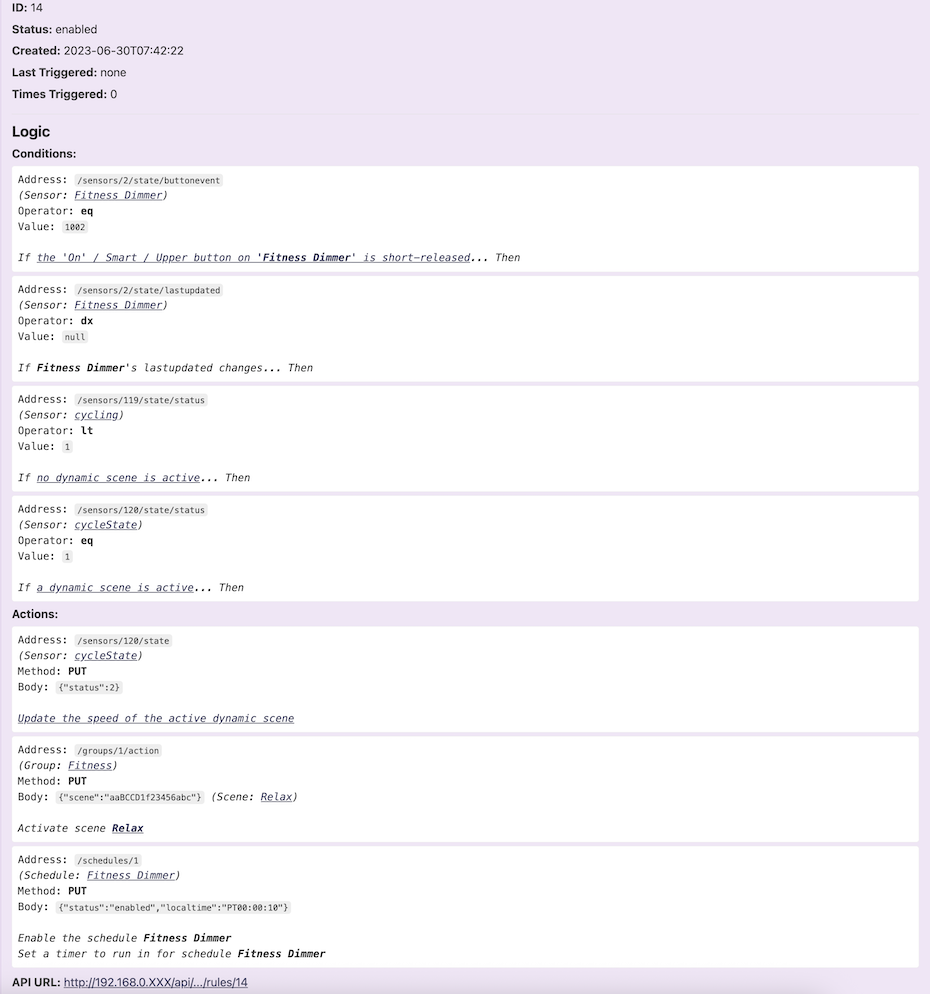

# hue-reporter

This cross-platform script connects to one or more Philips Hue Bridges, fetches data about all assets using an optimised set of API calls, and generates a human-readable HTML report as well as a raw JSON data dump. For multi-bridge setups, it fetches data in parallel to save time.

## Disclaimer

**Read-Only:** This script is for reporting and visualization purposes only. It performs read-only operations and will not make any changes to the state of your Hue lights, switches, or any other devices. It is a safe tool for visualization and research of your Hue system's configuration.

## Features

- **Comprehensive Reporting:** Generates a detailed HTML report of all Hue assets, including lights, switches, sensors, and more.
- **Rich Visualizations:** The HTML report generates rich, dynamic infographics to visually represent brightness, saturation, hue, and color temperature. For Entertainment groups, it creates a 3D representation of the light positions, helping to visualize their spatial arrangement.
- **Raw Data Export:** Creates a `hue-data.json` file containing the complete, unprocessed data from the Hue Bridge(s) for advanced analysis.
- **Multi-Bridge Support:** Connects to multiple Hue Bridges simultaneously, fetching data in parallel to minimize execution time.
- **optimised API Usage:** Uses an optimised number of API calls to retrieve all resource data, including detailed scene information, making it fast and efficient.
- **Intelligent Rule Analysis:** Intelligently decodes and links rules, conditions, and actions to the corresponding sensors, lights, groups, and schedules, providing a human-readable interpretation of your Hue system's logic.
- **Easy Configuration:** A simple JSON file (`hue_bridges_conf.json`) is used to configure the bridge(s).
- **Plain Text support for Serial Numbers import:** An optional `hue_serials_mapping-plain-text-info.txt` file allows you to map device serial numbers to your devices.

## Example Report

The script generates a detailed HTML report. Here are examples of the information and visualizations for groups, lights, scenes and rules:

- **Light**

  

- **Group**

  

- **Scene**

  

- **Rule**

  

## Prerequisites

This script requires a Bash-compatible shell and the `jq` command-line tool. `curl` is also used but is included by default in the recommended environments.

### 1. Bash-Compatible Shell

- **macOS & Linux:** The default Terminal is sufficient.
- **Windows:** You have two primary options:
  - **Windows Subsystem for Linux (WSL):** The recommended method. It provides a complete Linux environment within Windows. You can install it from the Microsoft Store.
  - **Git for Windows:** Provides "Git Bash," a lightweight and capable Bash shell. Download it from [git-scm.com](https://git-scm.com/download/win).

### 2. jq (JSON Processor)

- **macOS (using Homebrew):**
  ```bash
  brew install jq
  ```
- **Linux (Debian/Ubuntu/WSL):**
  ```bash
  sudo apt-get update && sudo apt-get install -y jq
  ```
- **Linux (Fedora/CentOS/RHEL):**
  ```bash
  sudo dnf install jq
  ```
- **Windows (using package managers):**
  - With [Chocolatey](https://chocolatey.org/):
    ```powershell
    choco install jq
    ```
  - With [winget](https://learn.microsoft.com/en-us/windows/package-manager/winget/):
    ```powershell
    winget install jqlang.jq
    ```
- **Windows (Manual):**
  Download the executable from the [jq website](https://jqlang.github.io/jq/download/) and place it in a directory included in your system's PATH.

## Installation & Configuration

1.  **Clone the repository or download the files.**

2.  **Configure your Hue Bridge(s):**

    Create a file named `hue_bridges_conf.json` in the same directory as the script. This file should contain a JSON array of your Hue Bridge(s).

    **Example for a single bridge:**

    ```json
    [
      {
        "bridge_name": "My Hue Bridge",
        "bridge_ip": "192.168.1.100",
        "hue_api_key": "YOUR_API_KEY_HERE"
      }
    ]
    ```

    **Example for multiple bridges:**

    ```json
    [
      {
        "bridge_name": "Living Room Bridge",
        "bridge_ip": "192.168.1.100",
        "hue_api_key": "LIVING_ROOM_API_KEY"
      },
      {
        "bridge_name": "Bedroom Bridge",
        "bridge_ip": "192.168.1.101",
        "hue_api_key": "BEDROOM_API_KEY"
      }
    ]
    ```

3.  **How to get a Hue API Key:**

    To get an API key (also called a username), you need to use the CLIP API debugger.

    - Navigate to `https://<your_bridge_ip>/debug/clip.html` in your web browser.
    - In the "URL" field, enter `/api`.
    - In the "Message Body" field, enter `{"devicetype":"hue-reporter#<your_name>"}` (e.g., `{"devicetype":"hue-reporter#john"}`).
    - Press the physical link button on your Hue Bridge.
    - Immediately click the "POST" button in the API debugger.
    - The response will contain your API key in the `username` field. Copy this value into your `hue_bridges_conf.json` file.

4.  **(Optional) Managing Device Serial Numbers:**

    The Hue API does not provide device serial numbers for security reasons. This script provides a way to manually add them to your report.

    - **How it Works:**

      1.  Run the script: `./hue-report.sh`
      2.  Choose option `2. Create/Update Light Serial Number Mapping File` from the menu.
      3.  The script will create/update a file named `hue_serials_mapping.json`. This file is a template, populated with all the lights from your bridge(s), including details like name, type, and group, to help you identify each device.
      4.  Edit the `hue_serials_mapping.json` file and fill in the `serialNumber` field for each light.
      5.  The next time you generate a report, the serial numbers will be included.

    - **Pre-populating with a Plain Text File (Optional):**
      To speed up the process, you can create a file named `hue_serials_mapping-plain-text-info.txt`. When you run the mapping file generator (option 2), the script will use this file to automatically fill in serial numbers it can match by device name.

      - **Format:** Use the pattern `SN: <SERIAL_NUMBER> -> <DEVICE_NAME>` on each line.
      - **Example:**
        ```
        # Living Room
        SN: H12345678 -> Living Room Ceiling 1
        SN: H87654321 -> Living Room Lamp
        ```

## Usage

Open your chosen Bash-compatible shell (Terminal on macOS/Linux, or WSL/Git Bash on Windows) and navigate to the project directory.

1.  **Make the script executable:**
    This command marks the script as runnable. You only need to do this once.

    ```bash
    chmod +x hue-report.sh
    ```

2.  **Run the script:**
    ```bash
    ./hue-report.sh
    ```

Note that you can run/call the script in a different folder from where your script and configuration files are stored, the produced HTML and JSON report files would be created where you run it not where the script is stored.

The script will then present a menu, connect to the configured bridge(s), fetch the data, and generate the output files.

## Output

The script generates two files with dynamic names based on the selected bridge(s) and the current timestamp.

- **HTML Report:** A detailed report providing a human-readable overview of all your Hue devices and their statuses.

  - **Filename format:** `Hue.Report-<BridgeName>-<Timestamp>.html`
  - **Example (single bridge):** `Hue.Report-Living.Room-2025-09-20_14-30-00.html`
  - **Example (all bridges):** `Hue.Report-All.Configured.Bridges-2025-09-20_14-30-00.html`

- **JSON Data Dump:** A file containing the raw, complete data fetched from the Hue Bridge API, useful for developers or other tools.
  - **Filename format:** `Hue.Report-<BridgeName>-<Timestamp>.json`
  - **Example (single bridge):** `Hue.Report-Living.Room-2025-09-20_14-30-00.json`
  - **Example (all bridges):** `Hue.Report-All.Configured.Bridges-2025-09-20_14-30-00.json`

## License

This project is licensed under the terms of the LICENSE file.

```

```
