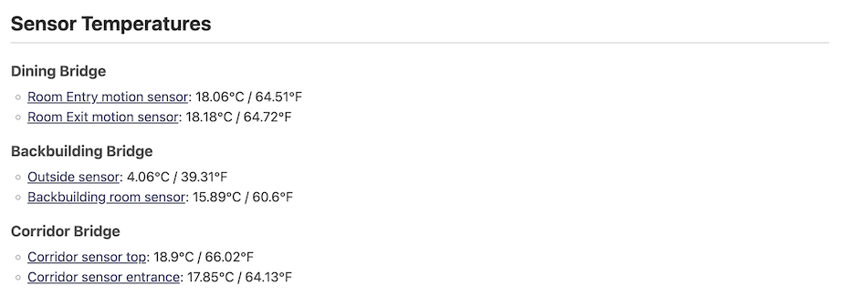
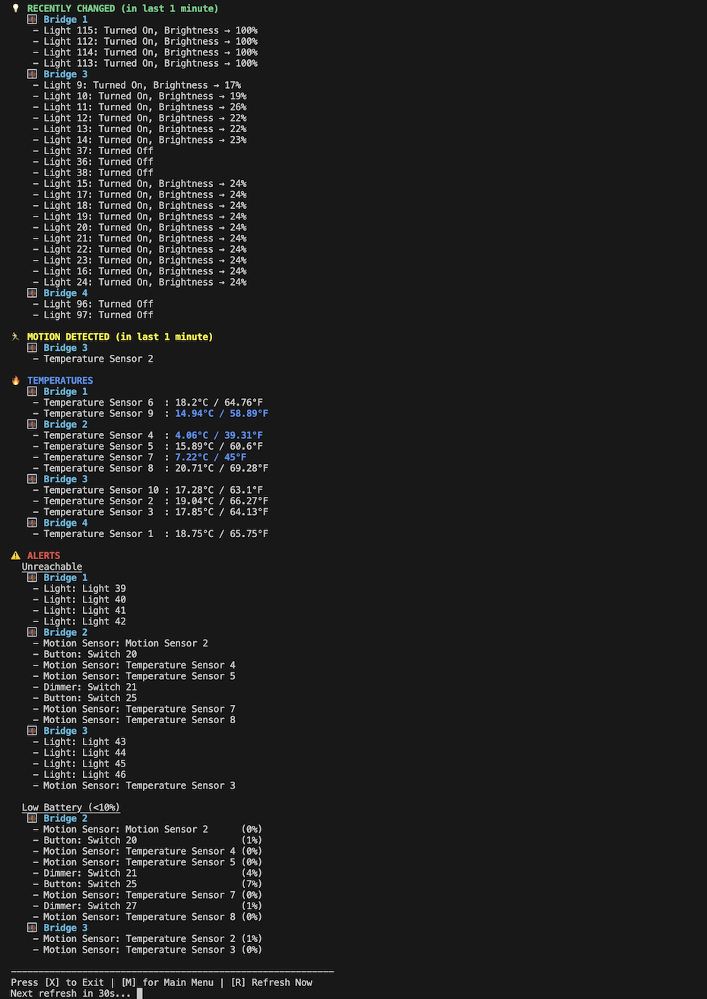

# Hue Reporter

This cross-platform script connects to one or more Philips Hue Bridges, fetches data about all assets using an optimised set of API calls, and generates a human-readable HTML report as well as a raw JSON data dump. For multi-bridge setups, it fetches data in parallel using a number of jobs appropriate for the system's CPU cores.

It can be run with an interactive menu or via command-line arguments for automation.

## Disclaimer

**Read-Only:** This script is for reporting and visualization purposes only. It performs read-only operations and will not make any changes to the state of your Hue lights, switches, or any other devices. It is a safe tool for visualization and research of your Hue system's configuration.

## Features

- **Comprehensive Reporting:** Generates a detailed HTML report of all Hue assets, including lights, groups, sensors, rules, and schedules.
- **Integrated Summaries:** The main HTML report includes summaries for low-battery devices, unreachable devices (lights, sensors, switches), and sensor temperatures for a quick overview.
- **Interactive HTML Report:** The generated report includes an interactive table of contents and summary links that allow you to jump directly to detailed sections.
- **Real-time Console Monitor:** Launch a console-based dashboard that periodically refreshes to show recent changes, including recent device state changes, motion detection, temperatures, and alerts for unreachable or low-battery devices.
- **Command-Line Interface:** Run tasks directly from the command line (e.g., `-b`, `-r`, `-m`) to bypass the menu, ideal for automation and scheduled tasks.
- **Flexible Output Formats:** Generate full HTML reports, simple summary HTML files, or raw JSON data files for easy integration with other tools.
- **Battery Level Reporting:** Quickly identify devices with low batteries, with intelligent de-duplication for motion sensors.
- **Temperature Reporting:** View the current temperature from all compatible motion sensors in Celsius and Fahrenheit.
- **Unreachable Device Reporting:** Get a list of all devices that are currently unreachable.
- **Rich Visualizations:** The HTML report generates dynamic infographics to visually represent brightness, saturation, hue, and color temperature. For Entertainment groups, it creates a 3D representation of the light positions.
- **Multi-Bridge Support:** Connects to multiple Hue Bridges simultaneously, fetching data in parallel to minimize execution time.
- **Optimised API Usage:** Uses an optimised number of API calls to retrieve all resource data, including detailed scene information, making it fast and efficient.
- **Intelligent Rule Analysis:** Decodes and links rules, conditions, and actions to the corresponding sensors, lights, and groups, providing a human-readable interpretation of your Hue system's logic.
- **Serial Number Management:** Provides a system for manually mapping serial numbers to your devices for a more complete inventory.
- **Easy Configuration:** A simple JSON file (`hue_bridges_conf.json`) is used to configure the bridge(s).
- **Plain Text support for Serial Numbers import:** An optional `hue_serials_mapping-plain-text-info.txt` file allows you to map device serial numbers to your devices.

### A Note on Motion Detection

The script's real-time monitor uses a robust method to detect motion that avoids the common pitfalls of the Hue v1 API. The risk of a false positive is extremely low.

For a motion sensor (`ZLLPresence` type), the script monitors the `state.lastupdated` timestamp. A change in this timestamp is almost exclusively triggered by a change in the sensor's primary attribute, `presence`.

Other data from the same physical device, such as battery level, temperature, or ambient light level, will not cause a false positive for motion. This is because the Hue Bridge cleverly exposes a single physical device as multiple _logical_ sensors, each with its own separate `state` object and `lastupdated` timestamp.

## Example Report

The script generates a detailed HTML report. Here are examples of the information and visualizations for groups, lights, scenes and rules. The report also contains a full table of contents and summary sections at the end for things like low battery levels and temperatures.

- **Light**

  

- **Group**

  

- **Scene**

  

- **Rule**

  

- **Temperatures**

  

- **Dashboard**

  

## Prerequisites

This script requires a Bash-compatible shell and the `jq` command-line tool. `curl` is also used but is included by default in the recommended environments.

### 1. Bash-Compatible Shell

- **macOS & Linux:** The default Terminal is sufficient.
- **Windows:** You have two primary options:
  - **Windows Subsystem for Linux (WSL):** The recommended method. It provides a complete Linux environment within Windows. You can install it from the Microsoft Store.
  - **Git for Windows:** Provides "Git Bash," a lightweight and capable Bash shell. Download it from [git-scm.com](https://git-scm.com/download/win).

### 2. jq (JSON Processor)

- **macOS (using Homebrew):**
  ```bash
  brew install jq
  ```
- **Linux (Debian/Ubuntu/WSL):**
  ```bash
  sudo apt-get update && sudo apt-get install -y jq
  ```
- **Linux (Fedora/CentOS/RHEL):**
  ```bash
  sudo dnf install jq
  ```
- **Windows (using package managers):**
  - With [Chocolatey](https://chocolatey.org/):
    ```powershell
    choco install jq
    ```
  - With [winget](https://learn.microsoft.com/en-us/windows/package-manager/winget/):
    ```powershell
    winget install jqlang.jq
    ```
- **Windows (Manual):**
  Download the executable from the [jq website](https://jqlang.github.io/jq/download/) and place it in a directory included in your system's PATH.

## Installation & Configuration

1.  **Clone the repository or download the files.**
2.  **Configure your Hue Bridge(s):**

    Create a file named `hue_bridges_conf.json` in the same directory as the script. This file should contain a JSON array of your Hue Bridge(s).

    **Example for a single bridge:**

    ```json
    [
      {
        "name": "My Hue Bridge",
        "ip": "192.168.1.100",
        "user": "YOUR_API_USER_HERE"
      }
    ]
    ```

    **Example for multiple bridges:**

    ```json
    [
      {
        "name": "Living Room Bridge",
        "ip": "192.168.1.100",
        "user": "LIVING_ROOM_API_USER"
      },
      {
        "name": "Bedroom Bridge",
        "ip": "192.168.1.101",
        "user": "BEDROOM_API_USER"
      }
    ]
    ```

3.  **How to get a Hue API User:**

    This is a one-time step for each bridge.

    a. In your terminal, run the following `curl` command, replacing `<BRIDGE_IP_ADDRESS>` with your bridge's IP.

    ```bash
    curl -X POST http://<BRIDGE_IP_ADDRESS>/api -H "Content-Type: application/json" -d '{"devicetype":"hue-report#computer"}'
    ```

    b. The command will respond with an error asking you to press the link button.

    ```json
    [
      {
        "error": {
          "type": 101,
          "address": "",
          "description": "link button not pressed"
        }
      }
    ]
    ```

    c. Within 30 seconds, physically press the round link button on your Hue Bridge.

    d. Run the exact same `curl` command from step **a** again. This time, you will get a success response containing your API user.

    ```json
    [{ "success": { "username": "THIS_IS_YOUR_API_USER_COPY_IT" } }]
    ```

    e. Copy this `username` value into your `hue_bridges_conf.json` file.

4.  **(Optional) Managing Device Serial Numbers:**

    The Hue API does not provide device serial numbers. This script provides a way to manually add them to your report.

    - **How it Works:**

      1.  Run the script: `./hue-report.sh`
      2.  Choose option `2. Create/Update Light Serial Number Mapping File` from the menu (or run `./hue-report.sh -s`).
      3.  The script will create/update a file named `hue_serials_mapping.json`. This file is a template, populated with all the lights from your bridge(s).
      4.  Edit the `hue_serials_mapping.json` file and fill in the `serialNumber` field for each light.
      5.  The next time you generate a report, the serial numbers will be included.

    - **Pre-populating with a Plain Text File (Optional):**
      To speed up the process, you can create a file named `hue_serials_mapping-plain-text-info.txt`. The script will use this file to automatically fill in serial numbers it can match by device name.

      - **Format:** Use the pattern `SN: <SERIAL_NUMBER> -> <DEVICE_NAME>` on each line.
      - **Example:**
        ```
        # Living Room
        SN: H12345678 -> Living Room Ceiling 1
        SN: H87654321 -> Living Room Lamp
        ```

## Usage

Navigate to the project directory in your chosen Bash-compatible shell.

Note that you can run/call the script in a different folder from where your script and configuration files are stored, the produced HTML and JSON report files would be created where you run it not where the script is stored. Only `hue_serials_mapping.json` would be stored where the script is stored (and not where it is run from), as this is a configuration file.

1.  **Make the script executable (first time only):**

    ```bash
    chmod +x hue-report.sh
    ```

2.  **Run in Interactive Mode:**
    To use the step-by-step menu, run the script with no arguments.

    ```bash
    ./hue-report.sh
    ```

3.  **Run in Direct Command Mode:**
    To run a task directly, provide a command argument and an optional output format. If both `--json` and `--html` are provided, both corresponding files will be created for the specified task.

    For a full list of commands and options, run:

    ```bash
    ./hue-report.sh --help
    ```

    ### Command Examples

    **Full Report**

    ```bash
    # Generate both HTML and JSON full reports (default for this command)
    ./hue-report.sh -r

    # Generate ONLY the JSON full report
    ./hue-report.sh --report --json

    # Generate ONLY the HTML full report
    ./hue-report.sh -r --html
    ```

    **Summary Tasks (Battery, Unreachable, List Devices)**

    ```bash
    # Get a quick console list of low-battery devices (default behavior)
    ./hue-report.sh -b

    # Get the current temperature from motion sensors
    ./hue-report.sh -t

    # Get a list of unreachable devices as a simple HTML file
    ./hue-report.sh -u --html

    # Generate both an HTML and a JSON file for unreachable devices
    ./hue-report.sh -u --json --html

    # Get a full list of all devices as a raw JSON file
    ./hue-report.sh -d --json
    ```

    **Serials Management**

    ```bash
    # Create or update the hue_serials_mapping.json file in the script's directory.
    # This command does not have other output options as it only creates/updates a configuration file.
    ./hue-report.sh -s
    ```

    **Real-time Monitoring**

    ```bash
    # Launch the real-time console monitor. Press 'X' to exit.
    ./hue-report.sh -m

    # or using the full command name
    ./hue-report.sh --realtime-mode
    ```

## Output

The script generates files with dynamic names based on the task, selected bridge(s), and the current timestamp.

### Full Report Files (`--report`)

These files contain a comprehensive report on all Hue assets.

- **HTML Format:** `Hue.Report-<BridgeName>-<Timestamp>.html`
- **JSON Format:** `Hue.Report-<BridgeName>-<Timestamp>.json`
- **Example (single bridge):** `Hue.Report-Living.Room-2025-09-22_16-05-00.html`
- **Example (all bridges):** `Hue.Report-All.Configured.Bridges-2025-09-22_16-05-00.json`

### Summary Task Files

These files are created by tasks like `--battery-check` or `--unreachable` and contain only the data relevant to that specific task. These tasks always run on all configured bridges.

- **Format:** `Hue.<TaskName>-All.Bridges-<Timestamp>.<extension>`
- **Example (Battery Check HTML):** `Hue.BatteryCheck-All.Bridges-2025-09-22_16-06-00.html`
- **Example (Unreachable JSON):** `Hue.Unreachable-All.Bridges-2025-09-22_16-07-00.json`
- **Example (Temperatures HTML):** `Hue.TemperatureCheck-All.Bridges-2025-09-22_16-08-00.html`

## License

This project is licensed under the terms of the LICENSE file.
